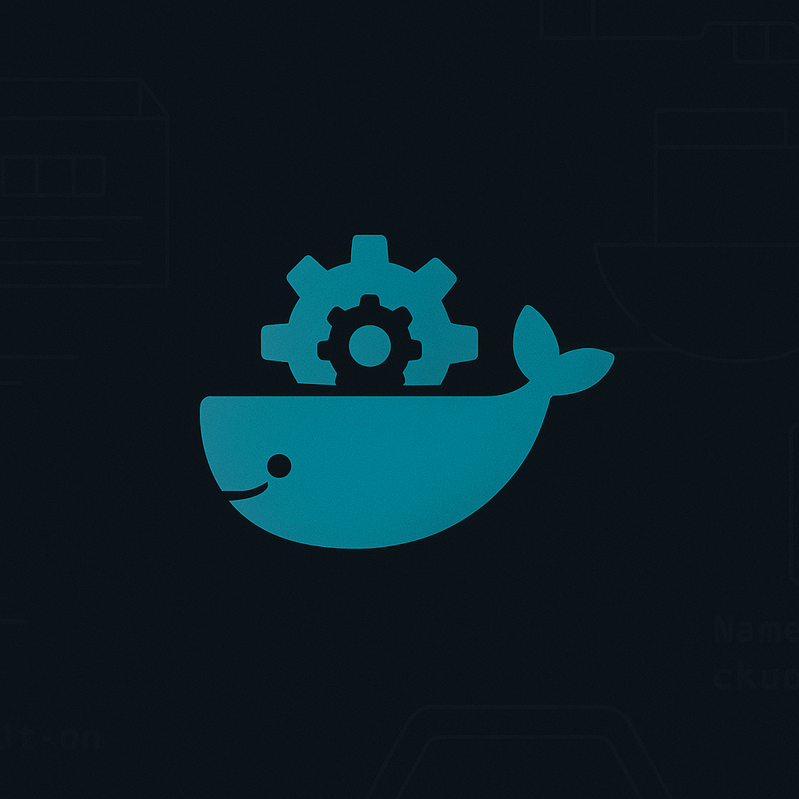
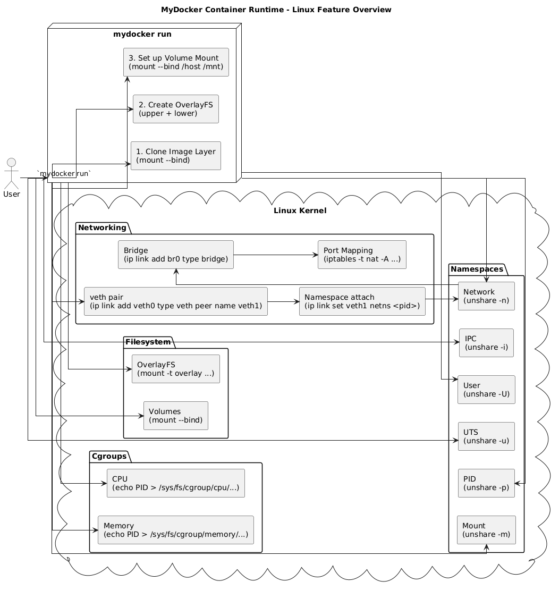

# 🐳 MyDocker

**MyDocker** is a lightweight container runtime built from scratch in Go that demonstrates how containerization works under the hood — similar to Docker but in a simplified form.


👉 [GitHub Repository](https://github.com/ravikisha/mydocker)

---

## 🚀 Features

- Container process isolation using Linux namespaces (`UTS`, `PID`, `NET`, `NS`)
- Resource control via cgroups (CPU & Memory)
- Volume mounting (`-v host:container`)
- Port mapping support (`-p host:container`)
- Simple OCI image unpacking using `umoci`
- Container image pulling, listing, and execution
- Custom bridge network (`mydocker0`) and veth pairs for network isolation
- Command-line interface similar to Docker (`run`, `exec`, `ps`, `stop`, `pull`, `images`, `version`)

---

## 🎯 Architecture



## 📦 Installation

> **Requirements**
> - Go 1.19+
> - Root access (for namespace and networking)
> - `umoci` tool installed and in `$PATH`
> - Linux OS (recommended: Ubuntu)


```bash
git clone https://github.com/ravikisha/mydocker.git
cd mydocker
go build -o mydocker main.go
sudo ./mydocker version
```

---

## 🧪 Usage Examples


### 📥 Pull an OCI Image

```bash
sudo ./mydocker pull ubuntu:22.04
```

### 🏃‍♂️ Run a Container

```bash
sudo ./mydocker run -v /host/data:/data -p 8080:80 ubuntu:22.04 sh
```

### 🔍 List Running Containers

```bash
sudo ./mydocker ps
```

### ⛔ Stop a Container

```bash
sudo ./mydocker stop <container_id>
```

### 🔧 Execute Command Inside a Container

```bash
sudo ./mydocker exec <container_id> ls /
```

### 🖼️ List Pulled Images

```bash
sudo ./mydocker images
```

---

## 🧰 Architecture Overview

* `main.go` — The CLI and container runtime entry point.
* `cgroups/` — Manages cgroup setup for resource limitations.
* `network/` — Contains logic to create bridge networks and virtual ethernet pairs.
* `/var/lib/mydocker/` — Stores container metadata, images, and runtime files.

---

## 📁 Project Structure

```
mydocker/
│
├── main.go
├── cgroups/
│   └── ...
├── network/
│   └── ...
├── helper.c
└── README.md
```

---

## 📸 Demo

> Here's a demonstration of running a container and executing commands in it:
> [https://github.com/ravikisha/mydocker](https://github.com/ravikisha/mydocker)

---

## ⚠️ Limitations

* No image build system (like `Dockerfile`)
* No layered filesystem support (OverlayFS)
* Only works on Linux with root privileges
* Networking is basic and doesn't support advanced DNS or isolation

---

## 📚 Learn More

This project is intended as a learning tool to understand:

* Linux namespaces and cgroups
* Container image unpacking (OCI)
* Custom CLI and Go systems programming
* How Docker-like runtimes work internally

---

## 🤝 Contributing

Pull requests, issues, and suggestions are welcome! Feel free to fork and play around.

---

## 📄 License

MIT License — See [LICENSE](LICENSE) for details.
